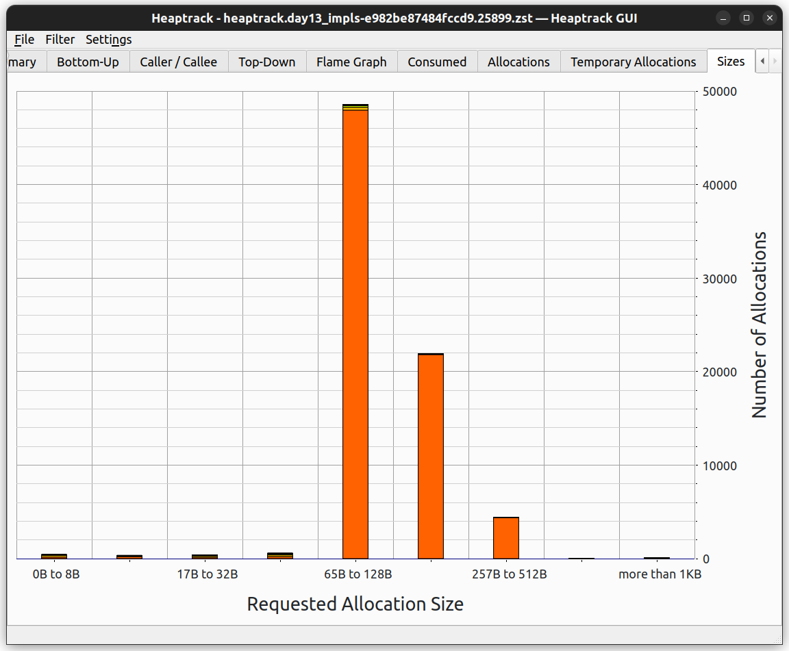

An informal case study on the performance of various approaches to solving the programming puzzle posed in Advent of Code 2022 Day 13, part A.

Major points can be navigated with the git tags
- line-splitting-v1
- line-splitting-v2
- line-splitting-v2-modded-lex+single-pass
- single_pass

Links to sections:  
1) [Problem](#problem)
2) [Findings](#findings)
3) [Implementations](#implementations)
4) [Benchmarking](#benchmarking)
5) [Related Media](#related-media)  

# Problem
The full prompt can be found at https://adventofcode.com/2022/day/13

In short, given an input like the below,
```py
[1,1,3,1,1]
[1,1,5,1,1]

[]
[3]

[[[]]]
[[]]

[1,[2,[3,[4,[5,6,7]]]],8,9]
[1,[2,[3,[4,[5,6,0]]]],8,9]
```
we want to identify the pairs of lines where the two lines are in lexicographical order (like a dictionary).


# Findings
Several design choices emerged as more effective, covered in corresponding sections below.
[Example plots](./assets), from data produced on my machine, are included for visualization purposes,
though the results will, of course, vary from machine to machine.

## Benchmarks Disclaimer
Evaluating the performance of a function / small program by measuring its run-time is prone to misleading results.
If the function is run in a tight loop and the same input is passed every time, this creates an unrealistic scenario.
The data and instructions will almost always be in the CPU cache and the branch predictor will quickly learn the pattern of branches.
This is rarely representative of how the function/program will interact with the rest of the program/system.
Also, factors outside the source code, such as the layout of the binary and environment variables,
can have surprisingly large effects on the runtime of the program -- Emery Berger covers this in depth in the video linked at the bottom.

More reliable results come from profiling the number of instructions executed and inspecting the generated assembly,
as well as measuring the branch and cache miss rates.
The tools described in the [Benchmarks.Profiling section](#Profiling) can help with this.
However, before comparing instruction counts and other absolute measurements, one must ensure that both runs are doing the same amount of 'work'.
Criterion, the benchmarking tool used here, runs each case for a fixed amount of time. 
This can cause more optimal implementations to end up executing more instructions, which is usually a metric we want to lower.

## Overall Performance Comparisons
The `input_handling_baseline` (red) is included in the plots below for comparison as the practical limit of performance.
It splits the input into pairs of lines, but performs a trivial comparison routine.


## Overall Cost-Benefit

While parsing the input, into JSON for instance, is by far the easiest approach as many libraries already exist for this purpose,
it is also the slowest by far, and the only solution to require more than O(1) memory.

The natural next step was to use a lexer. 
The lexer created with the `logos` crate was both easier to write and outperformed the hand-rolled lexer across the board.

As seen in the benchmarks for inputs with relatively long common prefixes
(original, orig repeated 1k, long mixed lines, single 10KB number),
the prefix comp strategies outperform the `logos` lexer considerably.


## Optimizations

### [Object pooling](https://en.wikipedia.org/wiki/Object_pool_pattern)

This is particularly impactful for inputs with many lines.
As you will see below in the chart comparing the normalized values,
the pooled variants outperformed their no-pool counterparts significantly more on the 2nd input (orig repeated 1k) than the 1st input (original).
The more lines in the input, the greater the effect of object pooling -
to generalize this to other programs, the more iterations or requests in a workload, the greater the benefit of object pooling.
As mentioned in the [implementation section](#implementations), this might otherwise be accomplished with arena allocations.
In fact, that would have a greater impact, as this implementation of object pooling moves the objects as opposed to borrowing them.


#### Heaptrack results

Heaptrack for naive_slice::no_pool on orig_repeated for 10s  


Heaptrack for naive_slice::pooled on orig_repeated for 10s  


The only difference between these two implementations is the reuse of `Vec`s.
While the number of iterations is not exactly equal, they were within a factor of 2,
so we can be confident that there are indeed several magnitudes fewer allocations being done.
On this input, the pooled variant had `42%` higher throughput.


#### Criterion results

pattern passed to criterion bench: `"Day13_A/naive"`

id to impl:

| id # | number repr | Object Pool |
|------|-------------|-------------|
| 1    | String      | y           |
| 2    | String      | n           |
| 3    | &str        | y           |
| 4    | &str        | n           |

| input_name \ impl name         | 1     | 2     | 3     |  4    | thrpt unit |
|--------------------------------|-------|-------|-------|-------|------------|
| original sample                | 59.83 | 45.32 | 82.54 | 75.88 | MiB/s      |
| orig sample repeated 1K        | 80.84 | 43.91 | 102.0 | 71.73 | MiB/s      |
| single 10kB number, last diff  | 605.8 | 609.3 | 595.2 | 565.8 | MiB/s      |
| single 10kB number, first diff | 588.1 | 604.6 | 606.8 | 600.6 | MiB/s      |
| long_mixed_lines               | 100.0 | 62.38 | 119.4 | 100.5 | MiB/s      |
| right_longer                   | 91.92 | 60.81 | 119.8 | 100.5 | MiB/s      |
| left_longer                    | 93.02 | 60.01 | 122.5 | 96.19 | MiB/s      |
| alternating_deep_nesting       | 52.73 | 25.20 | 61.92 | 37.11 | MiB/s      |


That same data, normalized against column 2 (`naive::no_pool`) (String + no pool):

| input_name \ impl name         | 1    | 2   | 3    | 4    |
|--------------------------------|------|-----|------|------|
| original sample                | 1.32 | 1.0 | 1.82 | 1.67 |
| orig sample repeated 1K        | 1.84 | 1.0 | 2.32 | 1.63 |
| single 10kB number, last diff  | .994 | 1.0 | .977 | .929 |
| single 10kB number, first diff | .973 | 1.0 | 1.00 | .993 |
| long_mixed_lines               | 1.60 | 1.0 | 1.91 | 1.61 |
| right_longer                   | 1.51 | 1.0 | 1.97 | 1.65 |
| left_longer                    | 1.55 | 1.0 | 2.04 | 1.60 |
| alternating_deep_nesting       | 2.09 | 1.0 | 2.46 | 1.47 |
| geometric mean                 | 1.44 | 1.0 | 1.72 | 1.35 |


### Not validating input
Two major performance improvements came with a loosening of the correctness.
* Parsing -> Lexing:  
   Characters are only read until a comparison decision is made,
   so invalid input after a differing character is not detected.
   This can be mitigated by continuing to lex both lines after a comparison is made.
* Lexing -> prefix comp:  
   The characters in the matched prefixes are assumed to be valid and are not actually lexed 
   This can be mitigated by lexing *one* of the matched prefixes. 
   Only one of the matching prefixes needs to be lexed because they are by definition identical.
   The above mitigation for lexing would also need to be applied.

Normally, it is critical to validate user input.
However, significant optimizations are possible when valid input is assumed. 
There is the general benefit of fewer branches and smaller code size, since fewer error cases are handled.
The more significant gains come from opportunities to skip part of the input,
or use a weaker and less expensive operation -
in the case of prefix comp, (SIMD) byte equality comparisons instead of matching on lexemes.

How could this be applied to a real application where input cannot be trusted?
Ironically, performing two passes on the input might be advantageous.
The first pass would only validate the input,
which for most languages just requires a stack of token types.
The second pass would parse the inputs not rejected by the first pass.

Furthermore, the first pass can be used to collect statistics on the input,
potentially allowing the parser to pre-allocate memory for the nodes.
Another advantage to separating out the validation step is when building an AST and invalid input is common -
the partial AST won't be built up and frequently thrown away, reducing pressure on the allocator.


### Performing fewer passes over strings
As one would imagine, performing fewer passes over the input when parsing/lexing is generally better.


#### line-splitting V1 vs V2
The key difference is that the framework now only scans each line once, instead of one-and-a-half times.
This change was not as impactful for the slower implementations (of `line_comparator`),
but was significant for the leaner implementations such as `prefix_comp`.
It is also likely that splitting on a single character is easier to optimize than splitting on a multi-char string.

#### single_pass_prefix_comp_then_logos_lex
As seen in the [histograms comparing the throughput of each implementation](#overall-performance-comparisons),
the single-pass prefix comp implementation, described [here](#single-pass-prefix-compare)

#### General
This can be applied to parsing code that relies on a buffered reader and/or nested splits,
ex: splitting on newlines then splitting on commas.


# Implementations
Brief descriptions of components of the various implementations.

## Line splitting
Most of the implementations shared this portion of the code, which extracts the pairs of lines from the input, and differed only in how they compared the two lines.
The performance of just this code can be approximated by [input_handling_baseline.rs](./src/input_handling_baseline.rs).

### v1
```rust
use std::cmp::Ordering;

pub(crate) fn day13_framework(
    input: &str,
    mut line_comparator: impl FnMut(&str, &str) -> Ordering,
) -> usize {
    input
        .split("\n\n")
        .map(|chunk| {
            chunk
                .split_once('\n')
                .unwrap_or_else(|| panic!("strange format: {chunk}"))
        })
        .map(|(l, r)| line_comparator(l, r))
        .enumerate()
        .filter_map(|(idx, ord)| if ord.is_lt() { Some(idx + 1) } else { None })
        .sum()
}
```

### v2
Here, the `"\n\n"` split iterator was replaced with a while loop that fetches one line at a time. 
The impact of this is discussed in [this section](#line-splitting-v1-vs-v2).

Another interesting point is that this approach is easier to adapt to streamed input (readers)
```rust
use std::cmp::Ordering;

pub(crate) fn day13_framework(
    mut input: &str,
    mut line_comparator: impl FnMut(&str, &str) -> Ordering,
) -> usize {
    let mut count = 0;
    let mut idx = 1;
    while !input.is_empty() {
        let Some((left, rem)) = input.split_once('\n') else {break};
        let (right, rem) = rem.split_once('\n').unwrap_or((rem, ""));

        if line_comparator(left, right).is_lt() {
            count += idx;
        }

        input = rem.trim_start_matches('\n');
        idx += 1;
    }
    return count;
}
```

## Line compare

### Naive Parsing 
[naive.rs](./src/naive.rs) and [naive_slice.rs](./src/naive_slice.rs)  

Character-by-character parsing. 
The entire parse tree is constructed for both lines before the elements are compared.
```rust
enum Element {
    Num(String),
    List(Vec<Element>),
}
```
There are 4 implementations:
2 with object pools (and 2 without),
and 2 with string slices (and 2 without).

### Lexing
[manual_lex.rs](./src/manual_lex.rs) and [logos_lex.rs](./src/logos_lex.rs)  

Instead of creating and storing the parse trees, the individual lexemes from both lines are compared one-by-one.
A small (and constant) amount of extra space is used to track the 'depth' of braces.

1 implementation w/ character-by-character lexing and another using the `Logos` lexer generator crate.

#### Logos Lexer definition
```rust
#[logos(skip r"[ ]+")]
enum Token {
    #[token(",")]
    Comma,
    #[regex("\\[+")]
    LBraces,
    #[token("]")]
    RBrace,
    #[regex("[0-9]+")]
    Number,
}
```
The `LBraces` token groups together consecutive `[`s because this save some cycles on deeply nested lists without pessimizing normal inputs, and does not complicate the implementation.

### Prefix Compare + Lexing
[prefix_comp_then_logos_lex.rs](./src/prefix_comp_then_logos_lex.rs)  

This approach assumes the input is syntactically valid.
Byte-wise compare the left and right lines until either one line ends or a difference is found. 
Then a lexer is run on the remainders until either a decision is made or the two lines reach an equivalence point again.
Then the process repeats.

### 'Single-pass' Prefix Compare + ... 
[single_pass_prefix_comp_then_logos_lex.rs](./src/single_pass_prefix_comp_then_logos_lex.rs)  

Similar to the previous one, however the right line is not sliced before the comparison.
Instead, the compare subroutine takes in the `left` and *`rem`* string slices,
reads no further than the first new line in `rem`,
and returns the number of bytes into `rem` that were inspected.
The outer loop then searches for the end of the right line (the first line in rem) starting from that position.
```rust
fn compare_first_line(left: &str, rem: &str) -> (Ordering, usize) {
    // ...
}
```

## Object Pooling
The values were moved, as opposed to borrowed w/ `&mut`, for ease of implementation.
```rust
pub struct ResPool<'a, T> {
    items: Vec<T>,
    make_new: &'a mut dyn FnMut() -> T,
}

impl<'a, T> ResPool<'a, T> {
    pub(crate) fn new(supplier: &'a mut dyn FnMut() -> T) -> Self {
        ResPool {
            items: Vec::new(),
            make_new: supplier,
        }
    }
}

impl<'a, T> Alloc<T> for ResPool<'a, T> {
    fn deposit(&mut self, item: T) {
        self.items.push(item);
    }

    fn withdraw(&mut self) -> T {
        self.items.pop().unwrap_or_else(&mut self.make_new)
    }
}
```

In other languages, and possibly a later version of Rust, this could be achieved with custom allocators.


# Benchmarking

The [benchmarking disclaimer section](#benchmarks-disclaimer) details the drawbacks of only measuring run-time and the motivation for using the below profilers.

## Measuring
[criterion](https://docs.rs/criterion/latest/criterion/) is used for conducting the benchmarks.  

Here is a basic command that will benchmark all the implementations in the current commit,
with the bracketed text being an optional argument to record the data under a given name.
`cargo bench --bench day13_impls -- [--save-baseline put_name_here]`
More options, such as running a subset* of the cases or selecting an existing baseline (as opposed to the default, the most recent run) can be viewed at [the documentation for Criterion](https://bheisler.github.io/criterion.rs/book/user_guide/command_line_options.html)
*for filtering, as seen in the provided [scripts](./scripts), I prefer to run the full suite then use `grep` to select particular implementations or inputs.

for quick reference, this will run the Criterion benchmark suite, but only the 'lex_logos' implementation will be tested, against just the 'original input' input.
```sh
cargo bench --bench day13_impls -- [other Criterion opts] "Day13_A/lex_logos/original input"
```

Here is the (subtly different!) equivalent for the other commands below that take an executable, 
```sh
{profile command} [other profiler options] {path/to/bench/executable} --bench "Day13_A/lex_logos/original input"
```
Specific examples for various profilers are found in their corresponding sections below =).


## Plotting
Additionally passing the options `--format terse --quiet`,
as well as redirecting stdout to a file, results in relatively-easy-to-parse output like below:
```sh
cargo bench --bench day13_impls -- --format terse --quiet  "Day13_A/" > benchdata.txt
```
```
Day13_A/input_handling_baseline/long_mixed_lines
                        time:   [248.13 ns 249.53 ns 251.12 ns]
                        thrpt:  [2.8594 GiB/s 2.8776 GiB/s 2.8939 GiB/s]
Day13_A/input_handling_baseline/right_longer
                        time:   [154.47 ns 154.77 ns 155.09 ns]
                        thrpt:  [2.9544 GiB/s 2.9606 GiB/s 2.9664 GiB/s]
Day13_A/input_handling_baseline/left_longer
                        time:   [166.37 ns 170.65 ns 175.23 ns]
                        thrpt:  [2.6149 GiB/s 2.6851 GiB/s 2.7542 GiB/s]
Day13_A/input_handling_baseline/alternating_deep_nesting
                        time:   [132.27 ns 132.63 ns 133.02 ns]
                        thrpt:  [4.1589 GiB/s 4.1711 GiB/s 4.1824 GiB/s]
```

### QuickStart
The [sample data and plots](./assets) can be recreated with [the shell scripts](./scripts) `./scripts/run_all_benches.sh` + `./scripts/parse_and_plot_data.sh`

### GnuPlot
Since the `Criterion` crate already depends on `gnuplot`, I have created a pair of scripts to parse and plot the above output with gnuplot.

example usage:
1) run criterion benchmark command shown in parent section
   ```sh
   cargo bench --bench day13_impls -- --format terse --quiet  "Day13_A/" > benchdata.txt
   ```
2) translate raw benchmark output into `.data` and run plotting script
   ```sh
   ./scripts/cri_to_gp_data.py < benchdata.txt > example.data
   ./scripts/thrpt_bar_chart.gp example.data > outfile.png
   ```

3) open the .png file with your preferred image viewer. Firefox example shown below
   ```sh
   firefox ./barchart.png
   ```


## Profiling
Below are some tools and corresponding commands I have used to profile the code while benchmarking. (Tested on Linux, x86-64, Ubuntu 22.04, kernel 6.2._-generic).
Each tool has installation instructions, which can be found through the links.
Note that `perf`, and by extension `flamegraph`, requires access to perf events, which is often blocked for non-privileged users. On my machine, setting the value to `2` (default was `4`) seemed to be enough to get `perf` working.

### [Heaptrack](https://github.com/KDE/heaptrack)
```sh
RUSTFLAGS="-g" CARGO_PROFILE_BENCH_DEBUG="true" cargo bench --bench day13_impls --no-run
# find the newly created executable with the prefix "day13_impls"
BENCH="./target/release/deps/day13_impls-43b168dda538aecb"
heaptrack $BENCH --bench --profile-time 10 Day13_A/prefix_comp
```

### [Valgrind](https://valgrind.org/)
Here is a helpful intro to [Rust + Criterion + Valgrind](https://nickb.dev/blog/guidelines-on-benchmarking-and-rust/)
```sh
# build bench profile, but don't run
# as of this writing, cargo build --bench was *not* equivalent
RUSTFLAGS="-g" CARGO_PROFILE_BENCH_DEBUG="true" cargo bench --no-run

# find the newly created executable with the prefix "day13_impls" (should be in the console output of the above cargo command)
BENCH="./target/release/deps/day13_impls-43b168dda538aecb"
valgrind --tool=callgrind --dump-instr=yes --collect-jumps=yes --cache-sim=yes $BENCH --bench --profile-time 10
```

### [Perf](https://perf.wiki.kernel.org/index.php/Main_Page)
(I installed it through the linux-tools-`uname -r` package in apt)
```sh
# follow earlier instructions for building and finding the bench executable
perf stat -d -d -d -- $BENCH  --bench --profile-time 10 Day13_A/to
```

### [Flamegraph](https://github.com/flamegraph-rs/flamegraph)
This uses `perf` to (basically) sample function calls, and can be used to identify the functions where time is being spent.

```sh
# follow earlier instructions for building and finding the bench executable
flamegraph -- $BENCH --bench --profile-time 10
```
Because a lot of data will be captured (output file defaults to "./perf.data"), I would strongly recommend running the above benchmark with a single implementation selected, and possibly a single input.
ex:
to run just the 'logos_lex' impl on all the input: `flamegraph -- $BENCH --bench --profile-time 10 "Day13_A/logos_lex"`
to run just the 'logos_lex' impl on just the 'original input': `flamegraph -- $BENCH --bench --profile-time 10 "Day13_A/logos_lex/original input"`

Unfortunately, the criterion harness adds a bit of noise to the flamegraph, so to focus on the relevant portions of the flamegraph, navigate to these blocks in order:
1) `day13_impls::main`
2) `criterion::routine::Routine::profile`
3) `<criterion::routine::Function<M,F,T> as criterion::routine::Routine<M,T>>::bench`
4) `day13_compare::logos_lex::day13`, where logos_lex is the particular implementation you want to investigate

Larger values of `--profile-time` will also help the `day13` to stand out (over the warm_up and set-up functions).
For instance, passing 40 (seconds) made the day13 function account for 91% of the samples.


# Related Media
Some resources I found informative and helpful:
* ["Performance Matters" by Emery Berger](https://www.youtube.com/watch?v=r-TLSBdHe1A)  
* ["Parsing JSON Really Quickly: Lessons Learned"](https://www.youtube.com/watch?v=wlvKAT7SZIQ)  
* https://nickb.dev/blog/guidelines-on-benchmarking-and-rust/  

